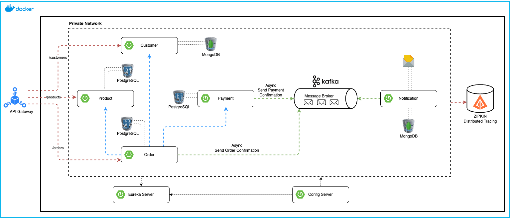
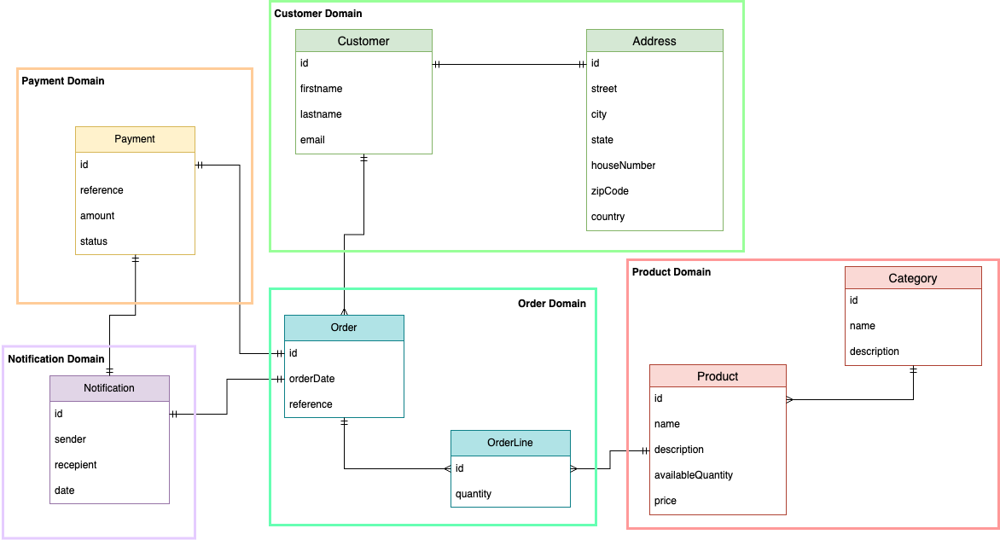

# E-Commerce Microservices Project


<div align="center">



</div>

## 🔍 Project Overview

This project implements a microservices-based e-commerce platform using Spring Boot 3 and Spring Cloud. The architecture is designed to be scalable, resilient, and cloud-native, leveraging modern technologies and best practices in distributed systems. The project follows Domain-Driven Design (DDD) principles to ensure a clear separation of concerns and align the software model with the business domain.

## ⚙️ Domain-Driven Design (DDD)


<div align="center">



</div>

This project employs Domain-Driven Design, a software design approach that focuses on modeling software to match a domain according to input from domain experts. Key aspects of DDD used in this project include:

1.  **Ubiquitous Language**: A common, shared language used by both developers and domain experts to describe the system's behaviors and entities.
2.  **Bounded Contexts**: Clear boundaries between different parts of the model, aligning with microservices architecture. Each microservice represents a bounded context (e.g., Customer, Order, Product).
3.  **Aggregates**: Cluster of domain objects treated as a single unit. For example, an Order aggregate might include Order Items.
4.  **Entities and Value Objects**: Distinction between objects with identity (Entities like Customer, Order) and objects that describe characteristics (Value Objects like Address, Payment).
5.  **Domain Events**: Use of events to communicate changes within and between bounded contexts, facilitated by Kafka in this architecture.
6.  **Repositories**: Abstraction of data storage, providing a more object-oriented view of persistence.

By applying DDD, this project aims to create a flexible, maintainable system that closely reflects the e-commerce business domain.

## 🛠️ Architecture

The system is composed of several microservices, each responsible for a specific domain:

1.  **Customer Service**: Manages customer information
2.  **Product Service**: Handles product catalog and inventory
3.  **Order Service**: Processes and manages orders
4.  **Payment Service**: Handles payment transactions
5.  **Notification Service**: Sends notifications to customers


### 🔐 Key Components

-   **API Gateway**: Entry point for all client requests, routing them to appropriate services
-   **Service Discovery (Eureka Server)**: Manages service registration and discovery
-   **Config Server**: Centralizes configuration management for all services
-   **Message Broker (Apache Kafka)**: Enables asynchronous communication between services
-   **Distributed Tracing (Zipkin)**: Provides tracing capabilities for debugging and monitoring
-   **Databases**: MongoDB and PostgreSQL is used for data persistence in various services

## 💻 Technologies Used

-   Spring Boot 3
-   Spring Cloud
-   MongoDB
-   Apache Kafka
-   Zipkin
-   Eureka Server
-   Keycloak

## 🗂️ Service Details

### 📁 Customer Service

-   Endpoint: `/customers`
-   Functionality: CRUD operations for customer data
-   Database: MongoDB
-   DDD Concepts: Customer Aggregate, Value Objects (e.g., Address)

### 📁 Product Service

-   Endpoint: `/products`
-   Functionality: Manage product catalog and inventory
-   Database: PostgreSQL
-   DDD Concepts: Product Aggregate, Value Objects (e.g., Price)

### 📁 Order Service

-   Endpoint: `/orders`
-   Functionality: Create and manage orders
-   Database: PostgreSQL
-   Interactions: Communicates with Product and Payment services
-   DDD Concepts: Order Aggregate (including Order Items), Domain Events (e.g., OrderPlaced)

### 📁 Payment Service

-   Functionality: Process payments for orders
-   Asynchronous Operation: Sends payment confirmation via Kafka
-   Database: PostgreSQL
-   DDD Concepts: Payment Aggregate, Domain Events (e.g., PaymentProcessed)

### 📁 Notification Service

-   Functionality: Sends notifications to customers
-   Consumes messages from Kafka to trigger notifications
-  Database: MongoDB
-   DDD Concepts: Notification Aggregate, Event Listeners

## 💭 Communication Patterns

-   Synchronous communication via REST API calls between services
-   Asynchronous communication using Apache Kafka for event-driven processes (e.g., order confirmations, payment processing)

## 🔧 Getting Started

This project is fully containerized using Docker. Follow these steps to set up your development environment:

1.  **Prerequisites**
    -   Install [Docker](https://www.docker.com/get-started)
    -   Install [Docker Compose](https://docs.docker.com/compose/install/)
2.  **Clone the Repository**

```bash
git clone https://github.com/fatihes1/ecommerce-microservices-spring-boot
cd ecommerce-microservices-spring-boot
```

3. **Start the Services** Run the following command in the project root:

```bash
docker-compose up -d
```
This will start the following services:
-   PostgreSQL (port 5432)
-   pgAdmin (port 5050)
-   MongoDB (port 27017)
-   Mongo Express (port 8081)
-   Zookeeper (port 22181)
-   Kafka (port 9092)
-   MailDev (ports 1080, 1025)
-   Zipkin (port 9411)
-   Keycloak (port 9098)

4. **Accessing Services**

-   pgAdmin: [http://localhost:5050](http://localhost:5050)
-   Mongo Express: [http://localhost:8081](http://localhost:8081)
-   MailDev: [http://localhost:1080](http://localhost:1080)
-   Zipkin: [http://localhost:9411](http://localhost:9411)
-   Keycloak: [http://localhost:9098](http://localhost:9098)

5. **Service Credentials**

-   PostgreSQL:
    -   User: fatichdev
    -   Password: fatichdev
-   MongoDB:
    -   User: fatichdev
    -   Password: fatichdev
-   Mongo Express:
    -   User: fatichdev
    -   Password: fatichdev
-   Keycloak:
    -   Admin User: admin
    -   Admin Password: admin

6. **Stopping the Services** To stop all services, run:

```bash
docker-compose down
```

8.  **Development Workflow**
    -   The microservices can be developed independently.
    -   Use the provided Docker services for databases and message brokers.
    -   Configure your microservices to connect to these Docker services.
    -
9.  **Notes**
    -   Data for PostgreSQL, pgAdmin, and MongoDB is persisted in Docker volumes.
    -   Kafka is accessible at `localhost:9092` from your host machine.
    -   For production deployment, ensure to change all default passwords and properly secure your services.

## 🙌🏼 Contributing

I welcome contributions to the E-Commerce Microservices Project! This section outlines the process for contributing to the project and our expectations for contributors.


### How to Contribute

1.  **Fork the Repository**
    -   Fork the project repository to your GitHub account.
    -   Clone your fork locally on your machine.
2.  **Create a Branch**
    -   Create a new branch for your contribution: `git checkout -b feature/your-feature-name`
    -   Use a clear and descriptive branch name.

3. -   **Make Your Changes**
-   Implement your changes or fixes in your branch.
-   Follow the coding standards and guidelines outlined below.

4. **Write or Update Tests**
    -   Add relevant tests for any new features or bug fixes.
    -   Ensure all existing tests pass.

5. **Document Your Changes**
    -   Update the README or other relevant documentation if necessary.
    -   Add comments to your code where needed.

6. **Commit Your Changes**
    -   Use clear and concise commit messages.
    -   Follow the [Conventional Commits](https://www.conventionalcommits.org/) specification.

7. **Push to Your Fork**
    - `git push origin feature/your-feature-name`

8. **Submit a Pull Request**

-   Open a pull request from your fork to the main project repository.
-   Provide a clear description of the changes and reference any relevant issues.

### Reporting Bugs

-   Use the GitHub Issues tracker to report bugs.
-   Describe the bug in detail, including steps to reproduce.
-   Include the version of the project you're using and your environment details.

## 🔒 Security with keycloak

If you want to add a security layer for requests,
1. First uncomment the fields belonging to the keycloak container in the docker-compose.yml file in the root directory and re-start the project.
2. After this stage, uncomment the entire file in the `services/gateway/src/main/java/com/fatichdev/gateway/security/SecurityConfig.java` directory.
3. Then, uncomment the fields defined with the comment line in the `src/main/resources/application.yml` directory.
4. Finally, add the following requirement to the dependency field in the `services/gateway/pom.xml` directory and reload the requirements with maven.
```yml
<dependency>
<groupId>org.springframework.boot</groupId>
<artifactId>spring-boot-starter-oauth2-resource-server</artifactId>
</dependency> 
```
You can make the necessary configurations via http://localhost:9098 and make your settings on the request sending tool you use (for example Postman) and impose authorization requirements on all endpoints.


